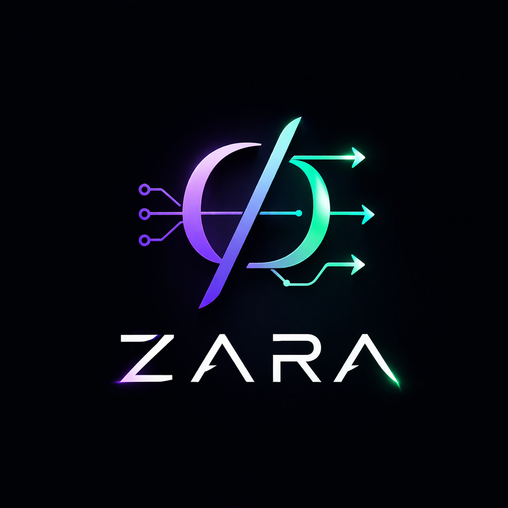

# ZARA RE FRAMEWORK

<p align="center">
  
</p>

ZARA RE FRAMEWORK is a native reverse engineering framework and desktop workstation for binary analysis, disassembly, graph reconstruction, decompilation, debugging, scripting, and AI-assisted analyst workflows.

The repository contains the C++ core, the native Qt desktop application, the CLI, the public SDK, fuzzing harnesses, and the release packaging used to ship desktop builds for Linux, macOS, and Windows.

**Developed by Regaan R, security researcher and founder of ROT Independent Security Research Lab.**

## What Zara Does

Zara is built around a single native analysis pipeline:

1. load a binary into a normalized image model
2. map sections and symbols into a virtual address space
3. decode instructions through the architecture layer
4. discover functions, basic blocks, edges, loops, and cross-references
5. lift into IR and SSA
6. run analysis, recovery, and simplification passes
7. generate decompiler output and persisted project data
8. expose the result through the desktop app, CLI, SDK, plugins, and optional AI workflows

The product is designed so the desktop UI, CLI, and automation layers all sit on the same core instead of reimplementing behavior in parallel.

## Core Capabilities

Current source tree capabilities include:

- native Qt desktop application for project-based reverse engineering
- CLI for analysis, automation, packaging, and scripted workflows
- PE, ELF, and Mach-O loading
- address-space mapping, rebasing, and symbol resolution
- disassembly across the supported architecture layer
- function discovery, CFG recovery, xrefs, and call graph generation
- IR, SSA, optimization, type recovery, and decompiler generation
- runtime debugging integration
- SQLite-backed project persistence
- Python-based plugins and automation
- optional AI-assisted summaries, rename suggestions, pattern detection, and vulnerability hints
- fuzzing, exploit workflow helpers, and distributed analysis infrastructure

## Desktop Application

The primary user interface is the native Qt Widgets application:

- startup launcher for new or existing projects
- function, import, export, string, and xref navigation
- disassembly, decompiler, CFG, call graph, hex, debugger, coverage, and annotation views
- comments, type annotations, version history, and workspace persistence
- `Settings -> AI` for hosted-model or local-LLM configuration
- `Help -> About` for product and author information

Run it from a build tree:

```bash
cmake --preset dev
cmake --build --preset dev
./build/dev/apps/desktop_qt/zara_desktop_qt
```

Open a binary directly:

```bash
./build/dev/apps/desktop_qt/zara_desktop_qt /path/to/binary.exe
```

Open a saved project database:

```bash
./build/dev/apps/desktop_qt/zara_desktop_qt /path/to/project.sqlite
```

## AI Integration

AI is optional. Zara works without a hosted model.

The desktop app supports:

- OpenAI
- Anthropic
- Gemini
- OpenAI-compatible gateways
- local LLM endpoints
- heuristic-only mode

Secrets are stored through the host platform rather than normal app settings:

- Windows Credential Manager
- macOS Keychain
- Linux Secret Service via `secret-tool`

## Build From Source

### Requirements

- CMake 3.26 or newer
- a C++20 compiler
- Ninja
- SQLite3 development files
- Qt 6 Widgets development files for the desktop build
- Capstone and cURL when building the full toolchain

### Build

```bash
cmake --preset dev
cmake --build --preset dev
```

Without presets:

```bash
cmake -S . -B build -G Ninja
cmake --build build
```

### Test

```bash
ctest --test-dir build/dev --output-on-failure
```

## CLI

Basic analysis:

```bash
./build/dev/apps/cli/zara_cli /path/to/binary
```

AI-assisted analysis with a hosted provider:

```bash
export ZARA_AI_BACKEND=openai
export ZARA_OPENAI_API_KEY=...
export ZARA_OPENAI_MODEL=gpt-5-mini
./build/dev/apps/cli/zara_cli ai-model /path/to/binary [/path/to/project.sqlite]
```

## Packages and Releases

The repository includes packaging and GitHub Actions release workflows for:

- Windows installer
- macOS DMG
- Linux AppImage
- Debian package
- Arch package

For Arch-based systems, the packaged build can be installed from the repository root:

```bash
makepkg -si
```

## Repository Layout

- `apps/desktop_qt`  
  Native Qt desktop application.
- `apps/cli`  
  Command-line tooling.
- `core`  
  Reverse engineering core, debugger, persistence, SDK, plugins, and AI integration.
- `docs`  
  Public technical documentation.
- `fuzz`  
  Sanitizer-backed hostile-input runners.
- `scripts`  
  Release and packaging helpers.
- `tests`  
  Regression and workflow test coverage.

## Documentation

- [Architecture](docs/architecture.md)
- [AI Integration](docs/ai_integration.md)
- [Fuzzing](docs/fuzzing.md)
- [SDK API](docs/sdk_api.md)

## Project Policies

- [Contributing](CONTRIBUTING.md)
- [Code of Conduct](CODE_OF_CONDUCT.md)
- [Security Policy](SECURITY.md)
- [License](LICENSE)

## License

Zara is licensed under the GNU Affero General Public License v3.0 or later.
